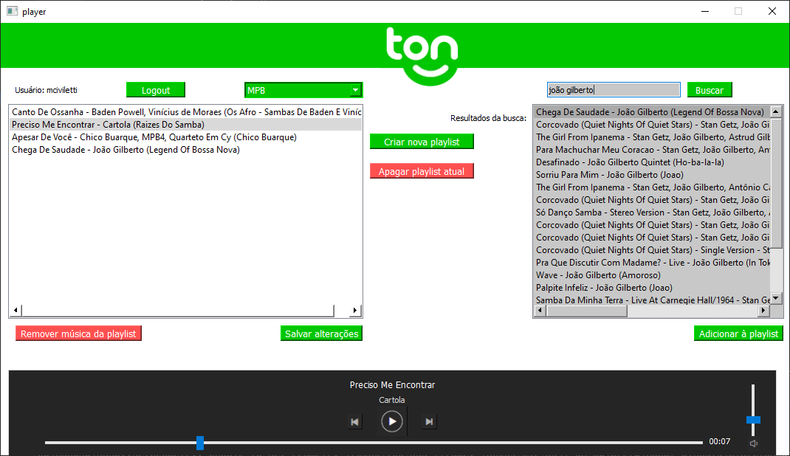

# Spotify Player
> Widget para reproduzir criar playlists locais e reproduzir samples do Spotify

Projeto desenvolvido no framework Qt para reproduzir de samples do spotify e criar e editar playlists offline.

Compilado utilizando kit 5.15.1 MSCV2015 64bit em Windows.



## Uso

O Widget funciona via comunicação HTTP com a API do Spotify

### Login
É necessário fazer Login para usar qualquer função do widget. Para tanto, basta clicar no botão "Login". A autenticação é feita via API do Spotify, portanto o programa nunca recebe o login nem senha do usuário.

### Interface
Após o Login realizado, um dropdown indica as playlists disponíveis para aquele usuário. Para criar nova playlist, basta clicar no respectivo botão.

A lista de itens à esquerda indica as músicas da playlist atual. À direita pode-se realizar uma busca por palavras chave, cujo resultado é mostrado na caixa à direita.

Para adicionar uma música à playlist, é necessário selecioná-la na caixa de resultados da busca e clicar no botão "Adicionar à playlist."

Para reproduzir uma música, basta ter uma playlist selecionada e clicar no botão play na parte inferior do widget para iniciar. Caso uma música específica da playlist esteja selecionada, esta música será reproduzida. Caso contrário, a música reproduzida será a primeira da playlist.

Quando uma música acaba, o widget automaticamente segue para a próxima da lista. Não havendo nenhuma música a seguir, o player para de tocar.

Caso a playlist selecionada seja trocada enquanto uma música é tocada, ao chegar ao final desta o player irá parar.

Também é possível clicar duas vezes em uma música da playlist para iniciar sua reprodução.

### Salvar alterações

Ao clicar no botão "Salvar alterações", a playlist atualmente selecionada será armazenada com os itens indicados na lista à esquerda. Caso o usuário crie ou remova uma playlist, não é necessário salvar pois o programa já o faz automaticamente.

No caso de remover, há um aviso para confirmação.

## Armazenamento
As playlists são salvas por padrão em formato CBOR (arquivo .dat) e interpretadas no programa com objetos Json. Para salvar/carregar em formato .json, basta alterar 
```
saveFormat = Binary;
```
para
```
saveFormat = Json;
```
no construtor da classe playlistManager no arquivo playlistManager.cpp

O formato CBOR ocupa menos espaço de armazenamento, sacrificando legibilidade ao usuário.

### Modelo do arquivo salvo

Na árvore abaixo, name[] é um vetor de objetos json, name[n] é uma entrada desse vetor (um objeto Json).

```sh
└── users[]
    ├── users[n]
    |   └── id (String)
    |   └── playlists[]
    |       ├── playlists[n]
    |       |   └── name (String)
    |       |   └── tracks[]
    |       |       ├── tracks[n]  
    |       |       |       ├── name (String)
    |       |       |       ├── artist (String)
    |       |       |       ├── album (String)
    |       |       |       ├── preview_url (String)
    |       |       |       └── id (String)
    |       |       |
    |       |       └── tracks[n]
    |       |
    |       └── playlists[n]    
    |
    |
    └── users[n]
```
Cada entrada do vetor users representa um usuário, cada entrada do vetor playlists representa uma playlist deste usuário e cada entrada do vetor tracks representa uma música desta playlist.
